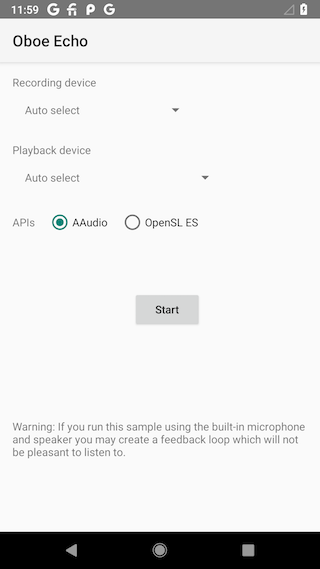

LiveEffect Sample
============

This sample simply loops audio from input stream to output stream to demonstrate
the usage of the 2 stream interfaces.

Screenshots
-----------

### Stream Configurations
- 48kHz
- oboe::I16
- stereo or mono

### Customizing the App

If you want to customize the effects processing then modify the
onBothStreamsReady() method in "src/main/cpp/FullDuplexPass.h"

### Caveats
OpenES SL does not allow setting the recording or playback device.

Synchronizing input and output streams for full-duplex operation is tricky.  

Input and output have different startup times. The input side may have to charge up the microphone circuit.
Also the initial timing for the output callback may be bursty as it fills the buffer up.
So when the output stream makes its first callback, the input buffer may be overflowing or empty or partially full.

In order to get into sync we go through a few phases.

* In Phase 1 we always drain the input buffer as much as possible, more than the output callback asks for. When we have done this for a while, we move to phase 2.
* In Phase 2 we optionally skip reading the input once to allow it to fill up with one burst. This makes it less likely to underflow on future reads.
* In Phase 3 we should be in a stable situation where the output is nearly full and the input is nearly empty.  You should be able to run for hours like this with no glitches.
