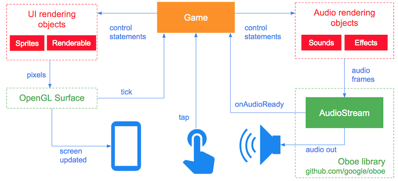
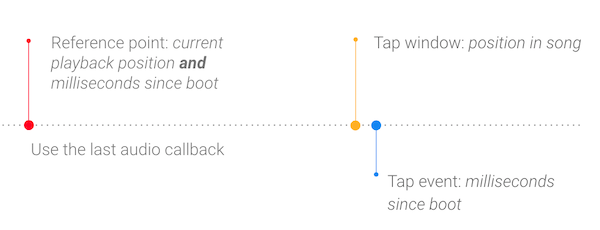
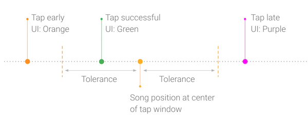

Rhythm Game sample
==================

This sample demonstrates how to build a simple musical game. The objective of the game is to clap in time to a song by copying what you hear. You do this by listening to the clap sounds, then tapping on the screen to copy those claps.

For a step-by-step guide on how this game works and how to build it check out this codelab: [Build a Musical Game using Oboe](https://developer.android.com/codelabs/musicalgame-using-oboe). 

Screenshots
-----------
The UI is deliberately very simple - just tap anywhere in the grey area after hearing the claps. The UI will change color to indicate the game state. The colors are: 

- Yellow: Game is loading (assets are being decompressed)
- Grey: Game is being played
- Orange: You tapped too early
- Green: You tapped on time
- Purple: You tapped too late
- Red: There was a problem loading the game (check logcat output)

### Audio timeline

The game plays the clap sounds on the first 3 beats of the bar. These are played in time with the backing track.

 When the user taps on the screen, a clap sound is played and the game checks whether the tap occurred within an acceptable time window.

### Architecture

Oboe provides the [`AudioStream`](https://github.com/google/oboe/blob/main/include/oboe/AudioStream.h) class and associated objects to allow the sample to output audio data to the audio device. All other objects are provided by the sample.

Each time the `AudioStream` needs more audio data it calls [`AudioDataCallback::onAudioReady`](https://github.com/google/oboe/blob/main/include/oboe/AudioStreamCallback.h). This passes a container array named `audioData` to the `Game` object which must then fill the array with `numFrames` of audio frames.

### Latency optimizations
The sample uses the following optimizations to obtain a low latency audio stream:

- Performance mode set to [Low Latency](https://github.com/google/oboe/blob/main/FullGuide.md#setting-performance-mode)
- Sharing mode set to [Exclusive](https://github.com/google/oboe/blob/main/FullGuide.md#sharing-mode)
- Buffer size set to twice the number of frames in a burst (double buffering)

### Audio rendering

The `IRenderableAudio` interface (abstract class) represents objects which can produce frames of audio data. The `Player` and `Mixer` objects both implement this interface.

Both the clap sound and backing tracks are represented by `Player` objects which are then mixed together using a `Mixer`.

### Sharing objects with the audio thread

It is very important that the audio thread (which calls the `onAudioReady` method) is never blocked. Blocking can cause underruns and audio glitches. To avoid blocking we use a `LockFreeQueue` to share information between the audio thread and other threads. The following diagram shows how claps are enqueued by pushing the clap times (in milliseconds) onto the queue, then dequeuing the clap time when the clap is played.

We also use [atomics](http://en.cppreference.com/w/cpp/atomic/atomic) to ensure that threads see a consistent view of any shared primitives.

### Keeping UI events and audio in sync

When a tap event arrives on the UI thread it only contains the time (milliseconds since boot) that the event occurred. We need to figure out what the song position was when the tap occurred. 

To do this we keep track of the song position and the time it was last updated. These values are updated each time the `onAudioReady` method is called. This enables us to keep the UI in sync with the audio timeline.

### Calculating whether a tap was successful
Once we know when the user tapped in the song, we can calculate whether that tap was successful i.e whether it fell within an acceptable time range. This range is known as the "tap window". 

Once we know the result of the tap the UI is updated with a color to give the user visual feedback. This is done in `getTapResult`. 

Note that once a tap has been received the tap window is removed from the queue - the user only gets one chance to get their tap right! 

### Use of compressed audio assets
In order to reduce APK size this game uses MP3 files for its audio assets. These are extracted on game startup in `AAssetDataSource::newFromCompressedAsset`. A yellow screen will be shown during this process. 

By default the game uses `NDKExtractor` for asset extraction and decoding. Under the hood this uses the [NDK Media APIs](https://developer.android.com/ndk/reference/group/media). 

There are some limitations with this approach: 

- Only available on API 21 and above
- No resampling: The extracted output format will match the input format of the MP3. In this case a sample rate of 48000. If your audio stream's sample rate doesn't match the assets will not be extracted and an error will be displayed in logcat. 
- 16-bit output only. 

A faster, more versatile solution is to use [FFmpeg](https://www.ffmpeg.org/). To do this follow [the instructions here](https://medium.com/@donturner/using-ffmpeg-for-faster-audio-decoding-967894e94e71) and use the `ffmpegExtractor` build variant found in `app.gradle`. The extraction will then be done by `FFmpegExtractor`.
